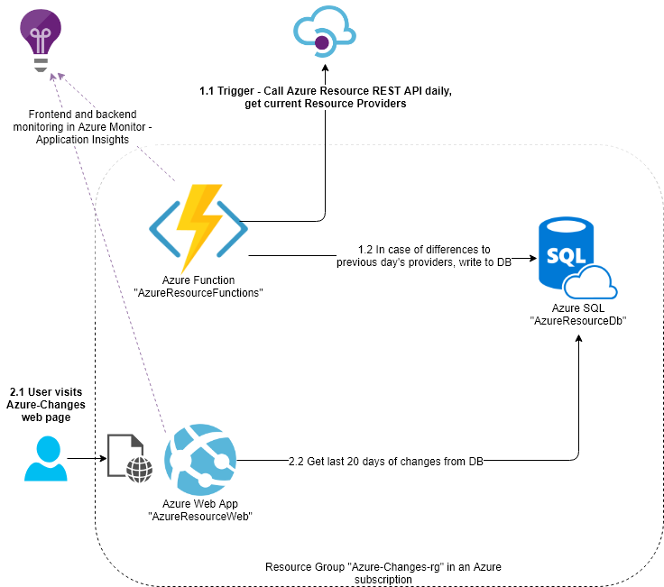

# AzureResourceDiff
This project gives the basis code for an Azure Function (AzureResourceFunctions) to take daily snapshots of the Azure registered resource providers for a subscription, calculate a difference to the preceding day, and save the results in a database.  Then the frontend web app (AzureResourceWeb) contains a web page that loads the information, and shows the last 20 days of changes.

# Architecture Diagram

# Try it here
https://azure-changes.azurewebsites.net/ 

# Projects
## AzureResourceCommon
.NET Standard library containing the DTO and repository classes.
### Configuration
* Environment Variable: **ConnectionString** with the Azure SQL connection to a database.

## AzureResourceFunctions
Serverless 2.0 functions to check the Azure API each day and see if there are any changes.  If there are, they are saved to the database through the repository in AzureResourceCommon.
### Configuration
* Environment Variable: **AzureWebJobsStorage** - Azure storage connection for functions (any storage account).
* Environment Variable: **AzureWebJobsDashboard** - Azure storage connection for function dashboard (any storage account).
* Environment Variable: **SpClientId** - Application Id used to call the Azure REST API, see info here for creating: [Azure API getting started](https://docs.microsoft.com/en-us/rest/api/azure/).
* Environment Variable: **SpClientSecret** - The secret for the Application Id used above.
* Environment Variable: **TenantId** - The Azure AD tenant Id for the application used above, .
* Environment Variable: **SubscriptionId** - The Azure subscription to be used for the API call

## AzureResourceWeb
ASP.NET Core 2.1 frontend web app to display the last 20 days of changes.
### Configuration
None

## Build and deployment instructions
* Execute the sql/schema.sql script in an Azure SQL DB
* Configure ConnectionString to db + other configuration variables above
* Open AzureResourceFunctions.sln in Visual Studio, build / debug to test locally
* Deploy Function & WebApp Azure, preferably using Azure DevOps pipelines connected to your git repository
* Enjoy the changes, they never stop :)

# Credits
- Thanks to the CodyHouse example Vertical Timeline here: https://codyhouse.co/gem/vertical-timeline/
- Thanks to jsondiffpatch.net here: https://github.com/wbish/jsondiffpatch.net
- Thanks to jsondiffpatch here: https://github.com/benjamine/jsondiffpatch
- Thanks to the loading animation here: https://tympanus.net/codrops/2012/11/14/creative-css-loading-animations/ 
